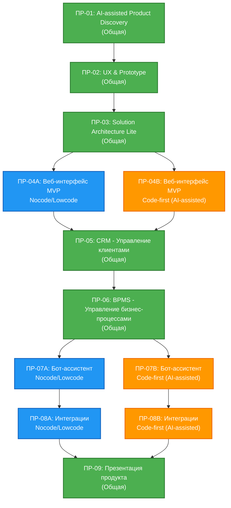

# Архитектура проекта ИСИС

```mermaid

flowchart TD
    %% Определение стилей (цвета как на референсе)
    classDef common fill:#4CAF50,stroke:#2E7D32,stroke-width:2px,color:white;
    classDef nocode fill:#2196F3,stroke:#1565C0,stroke-width:2px,color:white;
    classDef vibecode fill:#FF9800,stroke:#EF6C00,stroke-width:2px,color:white;

    %% --- Блок 1: Фундамент (Общие работы) ---
    PR01["ПР-01: AI-assisted Product Discovery<br/>(Общая)"]:::common
    PR02["ПР-02: UX & Prototype<br/>(Общая)"]:::common
    PR03["ПР-03: Solution Architecture Lite<br/>(Общая)"]:::common

    %% --- Блок 2: Витрина (Разделение треков) ---
    PR04A["ПР-04A: Веб-интерфейс MVP<br/>Nocode/Lowcode"]:::nocode
    PR04B["ПР-04B: Веб-интерфейс MVP<br/>Code-first (AI-assisted)"]:::vibecode

    %% --- Блок 3: Корпоративный центр (Снова вместе) ---
    PR05["ПР-05: CRM - Управление клиентами<br/>(Общая)"]:::common
    PR06["ПР-06: BPMS - Управление бизнес-процессами<br/>(Общая)"]:::common

    %% --- Блок 4: Экосистема и Интеграции (Разделение) ---
    PR07A["ПР-07A: Бот-ассистент<br/>Nocode/Lowcode"]:::nocode
    PR07B["ПР-07B: Бот-ассистент<br/>Code-first (AI-assisted)"]:::vibecode

    PR08A["ПР-08A: Интеграции<br/>Nocode/Lowcode"]:::nocode
    PR08B["ПР-08B: Интеграции<br/>Code-first (AI-assisted)"]:::vibecode

    %% --- Финал ---
    PR09["ПР-09: Презентация продукта<br/>(Общая)"]:::common

    %% --- Связи ---
    PR01 --> PR02
    PR02 --> PR03
    
    %% Развилка 1
    PR03 --> PR04A
    PR03 --> PR04B
    
    %% Слияние
    PR04A --> PR05
    PR04B --> PR05
    PR05 --> PR06
    
    %% Развилка 2
    PR06 --> PR07A
    PR06 --> PR07B
    
    PR07A --> PR08A
    PR07B --> PR08B
    
    %% Финальное слияние
    PR08A --> PR09
    PR08B --> PR09
```
